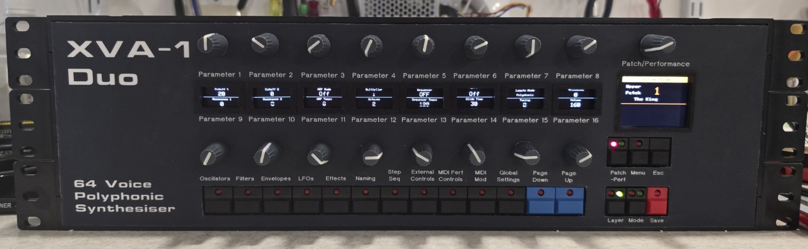
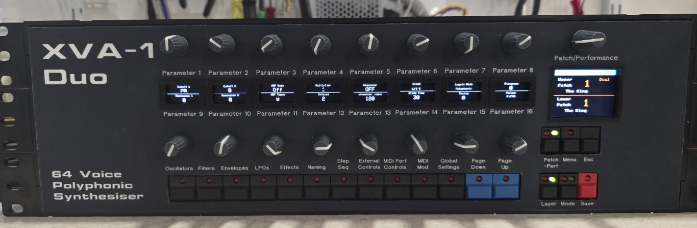
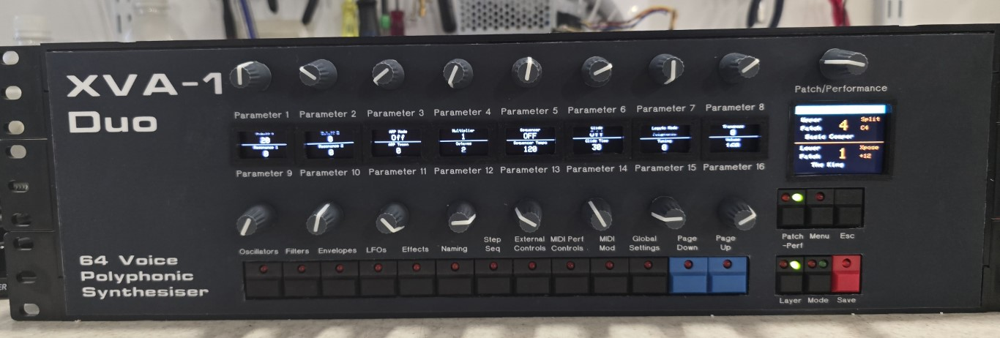

# Based on the previous dual XVA-1 keyboard which was never quite finished, I stripped guts from the keyboard to use in another project which left me with two XVA-1 boards, an editor based on a Teensy 3.6 and a 3 channel MIDI merger based on a Teensy 4.1.

Revisiting the XVA-1 project for a 3rd time, so last week I stole the UF-70 keyboard case housing from the XVA-1 project that I sort of completed 2 years ago. (Still needed work on dual functions). 

It was basically 2x XVA-1 boards that could be configured in whole mode, dual and split modes. The UF-70 sent notes on channels 1 and/or 2 depending how I wanted, it was clumsy and impractical. 

So now I've got to rehouse the controller and XVA-1 boards into a 19" rack and try to rewrite the code to manage the three modes whole (64 note poly), dual (32 note poly) and split (32 each side). 

Also I want to create performances from the patches to make creating sounds easier. 

The main issue was that I built it originally with a Teensy 3.6 soldered to the board, I had to extract that from the controller board and replace it with a socketed Teensy 4.1. 

I've already created some case artwork for the front panel but then I added larger display for the main display, 320*240.

Recently I added two more buttons and this gave me a MODE button and a PATCH/PERF button to switch between the two modes.

Setups are Whole mode, Dual mode and Split mode accessed by the MODE button, press and hold MODE for more than 500mS and you can press a key and set a split point that will be stored in memory and recalled on boot.

Performances can also be named upto 15 characters when in performance mode using the Naming Page

