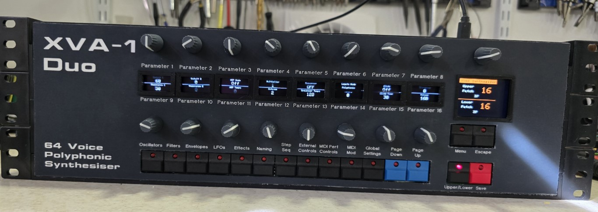

# Based on the previous dual XVA-1 keyboard which was never quite finished, I stripped guts from the keyboard to use in another project which left me with two XVA-1 boards, an editor based on a Teensy 3.6 and a 3 channel MIDI merger based on a Teensy 4.1.

